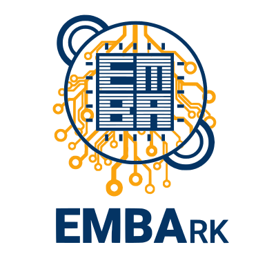

# Siemens Energy EMBA Project (AMOS SS 2021) <br> (Embark)


<p align="center">
  
</p>

- [About](#About)
- [Setup](#Setup)
- [Docker](#Docker)
- [Pipelines](#Pipelines)
- [Logging](#Logging)

## About

*Embark* is being developed to provide the Linux-based firmware analyzer *emba* as a containerized service, to ease 
accessibility to *emba* regardless of system and operating system.

Furthermore *Embark* is improves the data provision by aggregating the various *emba* outputs in a fancy dashboard.

## Installation

TODO

## Docker

The docker image is build using docker compose.  
See docker-compose.yml for further information.

Build your image  
`docker-compose build`

Bring your containers up  
`docker-compose up -d`

Test if django came up  
`curl -XGET 'http://0.0.0.0:8000'`  

You should get a response like this:
```<!-- Base Template for home page-->
<!DOCTYPE html>
<html>
<head>
    <title></title>
</head>
<body>
    <h1>EMBArk home!</h1>
</body>
```


If you want to run something from inside the container like a shell script to analyze some firmware
1. Paste that firmware inside directory `embark`
2. Exec(Enter) into your container with `docker exec -it amos-ss2021-emba-service_emba_1 bash`
3. Run your script.

---
## Pipelines

Currently there are two Pipelines running:
* Linter (pycodestyle / pep8)  
To check your conformity with pep8 locally: `pycodestyle . `  
To get further information about the violation run: `pycodestyle --show-source . `  
For further setting see [pycodestyle documentation](https://pycodestyle.pycqa.org/en/latest/intro.html)

* Unit Tests  
Pipeline runs the django test environment: `python manage.py test`  
This invokes all methodes in test classes labeled with ``test_``

---   
## Logging

For logging use pythons logging environment.  
Configuration can be found in `embark/manage.py`  

Example:
```console
import logging

[...]

logging.info("log message")
```

For further reading see [how to logging](https://docs.python.org/3/howto/logging.html).

---
You can inspect the emba repository [emba](https://github.com/e-m-b-a/emba) and get more [information about usage of *emba* in the wiki](https://github.com/e-m-b-a/emba/wiki/Usage).
